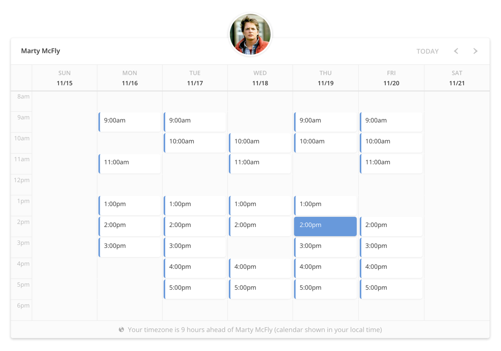

# Booking.js by Timekit

[](https://circleci.com/gh/timekit-io/booking-js)
[](https://www.codacy.com/app/laander/booking-js)

[**Releases & changelog**](https://github.com/timekit-io/booking-js/releases)

> Make a beautiful embeddable booking widget in minutes.



Uses *FullCalendar* with a custom theme for dynamic calendar rendering with available timeslots fetched from *Timekit* (through the Javascript SDK). The shown appointment slots can be booked with automatic calendar invites sent to both host and visitor. Integrates with *Google Calendar* for automatic availability.

Maintainer: Lasse Boisen Andersen ([la@timekit.io](mailto:la@timekit.io)). PR's are welcome!

## Get started

Visit [Timekit.io](https://www.timekit.io) to get started!  

You can use the widget in two different ways:  

1. For non-developers where the widget is configured in our UI admin panel. For this, you'll never need to touch any code - just follow the admin panel to get your embed code or hosted url.  
2. For developers where you can configure the widget on-the-fly for multi-user usage and more control. In this way, you don't need to generate a widget for each user through the Timekit admin. Timekit provides you with a modular and flexible API platform that allows you to integrate availability and bookings deep into your own product.  

*This repo is mainly for community contributions, docs and the curious soul that would like to customize the widget.*

## Dependencies

Stuff you need to load:

- [jQuery](https://jquery.com/) (v2.x.x) - primarily because it's a requisite for FullCalendar

Bundled together with the library:

- [fullCalendar](http://fullcalendar.io) - a customizable and flexible event calendar built for the browser
- [moment](https://momentjs.com) - parse, validate, manipulate, and display dates in JavaScript
- [timekit-js-sdk](https://github.com/timekit-io/js-sdk) - JavaScript SDK for the Timekit.io API

## Module loading

#### CDN
To ensure that we can push out updates, improvements and bugfixes to the library, we recommend that you load the library through our CDN. It's hosted on Amazon Cloudfront so it's snappy enough for production.  
```html
<script type="text/javascript" src="//ajax.googleapis.com/ajax/libs/jquery/2.1.3/jquery.min.js"></script>
<script type="text/javascript" src="//cdn.timekit.io/booking-js/v1/booking.min.js" defer></script>
```

#### UMD through NPM
The module is published on NPM and can be require'd as a CommonJS, AMD or in a script tag.  
`npm install timekit-booking`
```javascript
// Booking.js still needs access to jquery, so make sure its available
require('jquery')
// Pull in the module, ES2015 imports also works:
// import TimekitBooking from 'timekit-booking'
var TimekitBooking = require('timekit-booking')
// Booking.js is now available as local var TimekitBooking instead of global window.timekitBooking
var widget = new TimekitBooking();
```

## Usage

#### Autoload
The simplest and most universally compatible usage is with autoload. This will defer the loading of the library until the whole document has loaded and then look for `window.timekitBookingConfig` - if found, the library is loaded automatically. Note that in single page applications, you should not use this approach (see next section).

```html
<div id="bookingjs">
  <script type="text/javascript" src="//ajax.googleapis.com/ajax/libs/jquery/2.1.3/jquery.min.js"></script>
  <script type="text/javascript" src="//cdn.timekit.io/booking-js/v1/booking.min.js" defer></script>
  <script type="text/javascript">
    window.timekitBookingConfig = {
      app:      'your-app-slug-here',
      email:    'marty.mcfly@timekit.io',
      apiToken: 'bNpbFHRmrfZbtS5nEtCVl8sY5vUkOFCL',
      calendar: '8687f058-5b52-4fa4-885c-9294e52ab7d4',
      name:     'Marty McFly',
      avatar:   '../misc/avatar-mcfly.png'
    };
  </script>
</div>
```

#### Instantiation
If you intent to run multiple instances or want more control over initialization order, create a new instance. This is ideal for usage in single page applications like Angular.js, where you'd injecting `<div id="bookingjs">` async in your template and control it through JS in your controller/directive/component code.

```html
<div id="bookingjs">
  <script type="text/javascript" src="//ajax.googleapis.com/ajax/libs/jquery/2.1.3/jquery.min.js"></script>
  <script type="text/javascript" src="//cdn.timekit.io/booking-js/v1/booking.min.js"></script>
  <script type="text/javascript">
    var widget = new TimekitBooking();
    widget.init({
      app:      'your-app-slug-here',
      email:    'marty.mcfly@timekit.io',
      apiToken: 'bNpbFHRmrfZbtS5nEtCVl8sY5vUkOFCL',
      calendar: '8687f058-5b52-4fa4-885c-9294e52ab7d4'
    });
  </script>
</div>
```

## Authentication

The widget connects to the Timekit API behind the scenes and requires a Timekit account.

You can either connect with a Google account (recommended) or create a plain account (you'd have to enter availability and pull out events through the API).  
Visit the [setup wizard on Timekit](http://timekit.io).

The `app`, `email` and `apiToken` settings are the key part here. When you've registered an app, created a user and generated a widget credentials, you get a special client-token with limited access. It's only capable of hitting certain endpoints so your account stays secure when using the widget in a public browser environment.

## Configuration

Booking.js is made for various use-cases, so it's really extensible and customizable. We augment all the intrinsic options so you can overwrite them as needed, e.g. Timekit FindTime options or FullCalendar settings.

### Example

```javascript
{

  // Required
  app:                      '',   // Your Timekit registered app slug
  email:                    '',   // Your Timekit user's email (used for auth)
  apiToken:                 '',   // Your Timekit user's apiToken (as generated through the wizard)
  calendar:                 '',   // Your Timekit calendar ID that bookings should end up in

  // Optional
  targetEl:                 '#bookingjs', // Which element should we the library load into
  name:                     '',   // Display name to show in the header and timezone helper
  avatar:                   '',   // Provide an image URL for a circular image avatar
  autoload:                 true, // Auto initialization if config object is found on window var
  includeStyles:            true, // Inject fullCalendar and library styles in <head>
  goToFirstEvent:           true, // Display and scroll to the first upcoming event in the calendar (to avoid showing a blank calendar)
  bookingGraph:             'instant', // Set which booking flow graph that should be used (also supports "confirm_decline", see below)

  // Timekit JS SDK (see below)
  timekitConfig:            { ... },

  // Timekit FindTime endpoint (see below)
  timekitFindTime:          { ... },

  // Timekit CreateBooking endpoint (see below)
  timekitCreateBooking:     { ... },

  // Locale support presets (see below)
  localization:             { ... },

  // FullCalendar options (see below)
  fullCalendar:             { ... },

  // Customize form fields (see below)
  bookingFields:            { ... },

  // Register callbacks on events (see below)
  callbacks:                { ... }

}
```

### - `timekitConfig`

You can pass any of the [Timekit JS SDK](https://github.com/timekit-io/js-sdk) settings directly to the widget. This is mostly relevant if you're building a tighter integration with Timekit and have your own app registered on the platform.

As a shorthand, the app slug can be set using a root-level `app` config key too.

```javascript
timekitConfig: {
  app:          'your-app-slug-here' // Specify your app slug
}
```

### - `timekitFindTime`

The Find Time algorithm is a powerful query tool for availability. Booking.js is calling the endpoint `[POST] /findtime` through the JS SDK and takes all the arguments as mentioned on the official [docs](http://developers.timekit.io/docs/findtime). The most powerful aspect are the [filters](http://developers.timekit.io/docs/find-time-filters). By default, there's no filters applied.

There's only three default arguments out of the box:

```javascript
timekitFindTime: {
  future:       '4 weeks',      // Default, how long time into the future that timeslots should be returned
  length:       '1 hour',       // Default, the duration of the bookable timeslots
  emails:       [config.email], // Inserted dynamically from the "email" setting in the general config
},
```

### - `timekitCreateBooking`

When booking an event, the widget will call the `[POST] /bookings` endpoint through the JS SDK.

The booking engine in Timekit is a powerful state machine that can take input data (event details and customer info) and perform actions on that based on a chosen "flow graph".

At the time of writing, Timekit supports two graphs:  
1) `instant` - automatically confirm any incoming bookings, save it to calendar and send out notifications  
2) `confirm_decline` - creates the booking as tentative and send notification to owner with confirm/decline actions  

These can be set using the `bookingGraph` config key on the root config level.

You can override specific endpoint settings like so:

```javascript
timekitCreateBooking: {
  graph:          'instant',       // Inserted based on "bookingGraph" specified. See description above on flow graph
  action:         'confirm',       // If "instant" graph is chosen, it will instantly perform the "confirm" action. See description above on flow graph
  event: {    
    where:        'Online',        // Default, you may want to customize this to a specific location, TBD or whatever fits
    invite:       true,            // Default, makes sure that participants (the visitor) is sent a Google invite
    my_rsvp:      'accepted',      // Default, makes sure that the host has accepted the created event in Google
    start:        data.start,      // Inserted dynamically from the chosen timeslot
    end:          data.end,        // Inserted dynamically from the chosen timeslot
    what:         config.name + ' x '+ data.name, // Inserted dynamically based on the host and visitors names (you can replace it with a static string)
    calendar_id:  config.calendar, // Inserted dynamically from the "calendar" setting in the general config
    participants: [config.email, data.email], // Inserted dynamically based on host and visitors ()
    description:  data.comment || '' // Inserted dynamically based on the visitor's supplied comment (if field is enabled)
  },
  customer: {
    name:         data.name,       // Inserted dynamically based on visitors name
    email:        data.email,      // Inserted dynamically based on visitors email
    timezone:     moment.tz.guess() // Inserted dynamically based on visitors timezone (sniffed from browser/device settings)
  }
},
```

### - `fullCalendar`

You can supply and override all the [FullCalendar settings](http://fullcalendar.io/docs/):

```javascript
fullCalendar: {
  header: {
    left:       '',
    center:     '',
    right:      'today, prev, next'
  },
  views: {
    agenda: {
      displayEventEnd: false
    }
  },
  allDaySlot:   false,
  scrollTime:   '08:00:00',
  timezone:     'local',
  defaultView:  sizing.view,     // Inserted dynamically based on the current width of the widget
  height:       sizing.height,   // Inserted dynamically based on the current width of the widget
  eventClick:   function(event), // Handled internally in Booking.js (overwrite if you want to replace the booking page)
  windowResize: function(view)   // Handled internally in Booking.js (overwrite if you want to disable or change automatic resizing)
}
```

*See below for FullCalendar language support.*

### - `localization`

For quick localization of time/date formats, we provide a simple "preset" setting, `timeDateFormat`, that sets a range of different FullCalendar and localization settings.

By default, it's set to "12-hour clock, M/D/Y date format, Sunday first day of week" (`12h-mdy-sun`). It can be changed to "24-hour clock, D/M/Y date format, Monday first day of week" (`24h-dmy-mon`).

See `/examples/local-preset.htm`

```javascript
localization: {
  showTimezoneHelper: true, // Should the timezone difference helper (bottom) be shown?
  timeDateFormat: '12h-mdy-sun', // US-style per default. For EU-style formatting, use '24h-dmy-mon'
  bookingDateFormat: 'MMMM D, YYYY', // Override the default date format on the booking page
  bookingTimeFormat: 'h:mma' // Override the default time format on the booking page
  strings: { ... } // See below
},
```

For full language support, FullCalendar also takes a ["lang" option](http://fullcalendar.io/docs/text/lang/), accompanied by a language file. Make sure to use defer attribute on a script tag loading the language file if you are deferring booking.js, language file should be loaded after booking.js, but before initialization.

Remember to set `localization.timeDateFormat` to false so it doesn't override the language file's settings.

See `/examples/local-language.htm`

```javascript
fullCalendar: {
  lang: 'de'
},
localization: {
  timeDateFormat: false
}
```

If you're using the widget in another language, you might want to customize the text strings used in e.g. submit button and success message. This can be done in the `localization.strings` key.

See `/examples/local-strings.htm`

```javascript
localization: {
  strings: { // Customize string used in the widget, defaults are shown below
    submitText: 'Book it',
    successMessageTitle: 'Thanks!',
    successMessageBody: 'An invitation has been sent to: <br /> %s <br /><br /> Please accept the invitation to confirm the booking.',
    timezoneHelperLoading: 'Loading..',
    timezoneHelperDifferent: 'Your timezone is %s hours %s of %s (calendar shown in your local time)',
    timezoneHelperSame: 'You are in the same timezone as %s'
  }
}
```

### - `bookingFields`

You can customize the booking form fields and their settings in this section. Only the `name`, `email` and `comment` fields are enabled by default. The `name` and `email` fields have to be enabled and is always required (for the event creation to work properly). All other fields can be enabled/disabled.

If you're collecting user information before loading the widget, it can be useful to inject it into the form by setting the `prefilled` keys - just pass in the values and they will be set upon load. Combine it with `locked` to lock the fields for user input.

See `/examples/fields.htm`

```javascript
bookingFields: {
  name: {
    placeholder: 'Full name',
    prefilled: false,
    locked: false
  },
  email: {
    placeholder: 'E-mail',
    prefilled: false,
    locked: false
  },
  comment: {
    enabled: true,
    placeholder: 'Comment',
    prefilled: false,
    required: false,
    locked: false
  },
  phone: {
    enabled: false,
    placeholder: 'Phone number',
    prefilled: false,
    required: false,
    locked: false
  },
  voip: {
    enabled: false,
    placeholder: 'Skype username',
    prefilled: false,
    required: false,
    locked: false
  },
  location: {
    enabled: false,
    placeholder: 'Location',
    prefilled: false,
    required: false,
    locked: false
  }
}
```

### - `callbacks`

You can hook into events happening throughout the user flow and perform asynchronous events. This is especially powerful for saving user data to your CRM system or redirect users to a payment gateway after booking is finished.

Inspect to source code to learn more about in which order callbacks are fired. Complete list:

```javascript
callbacks: {
  findTimeStarted:          function(args) {},
  findTimeSuccessful:       function(response) {},
  findTimeFailed:           function(response) {},
  createBookingStarted:     function(args) {},
  createBookingSuccessful:  function(response) {},
  createBookingFailed:      function(response) {},
  getUserTimezoneStarted:   function(args) {},
  getUserTimezoneSuccessful:function(response) {},
  getUserTimezoneFailed:    function(response) {},
  fullCalendarInitialized:  function() {},
  renderCompleted:          function() {},
  showBookingPage:          function(event) {},
  closeBookingPage:         function() {},
  submitBookingForm:        function(values) {}
}
```

## Methods

After you instantiated the widget, you can control it with the following methods:

```javascript
var widget = new TimekitBooking();
widget.init(config);          // Initializes the widget with the given config
widget.render();              // Re-renders the widget with it's instance config
widget.setConfig(config);     // Push a new config into it (call render() afterwards)
widget.getConfig();           // Returns the current config
widget.destroy();             // Cleans the DOM element and empty config
widget.fullCalendar(action);  // Direct access to FullCalendar's own method (for advanced use)
```

*Only available when your using the instantiation approach and not autoload*

## Roadmap/todos

See [Issues](https://github.com/timekit-io/booking-js/issues) for feature requests, bugs etc.
